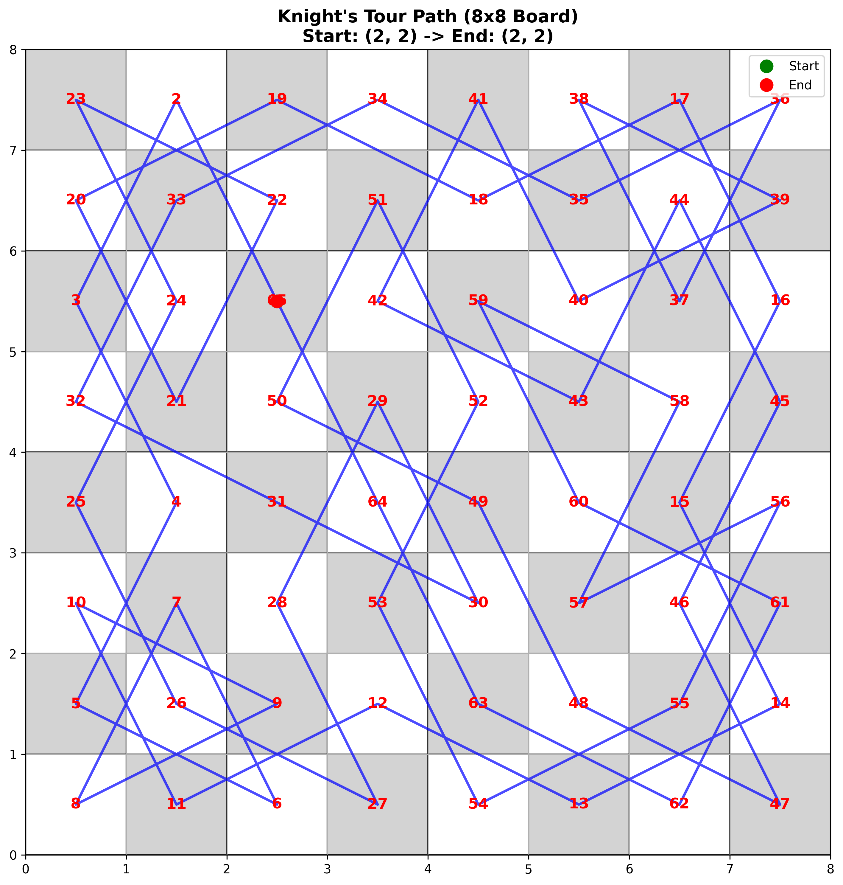
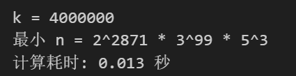
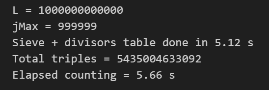

# Demo
问题1第1问

问题1第2问
用第一问相同解法在25*25棋盘时效率极差，查找问题中说的论文没有找到相关内容。
仅查找到闭合巡游的方式。
Optimal algorithms for constructing knight’s tours 该文章两个作者提到后续工作中会探索该问题，但后续两人未再合作并未发布相关内容。

问题2第1问

问题2第2问

问题2第3问

第三问耗时在c#仅0.9s